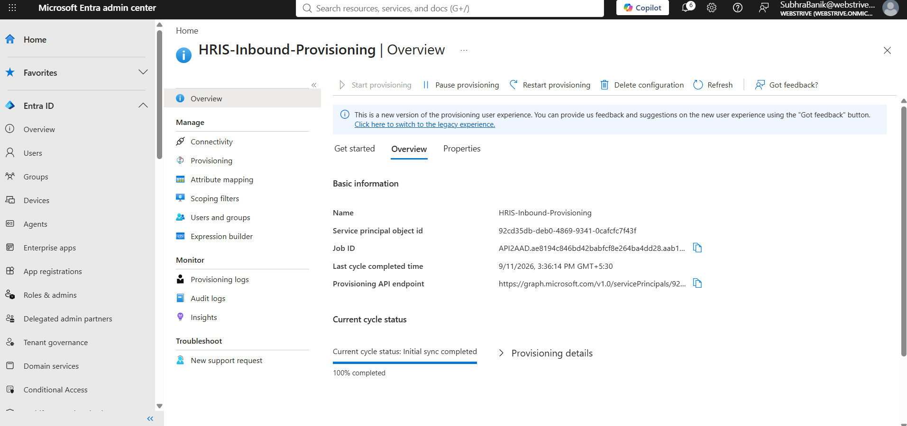
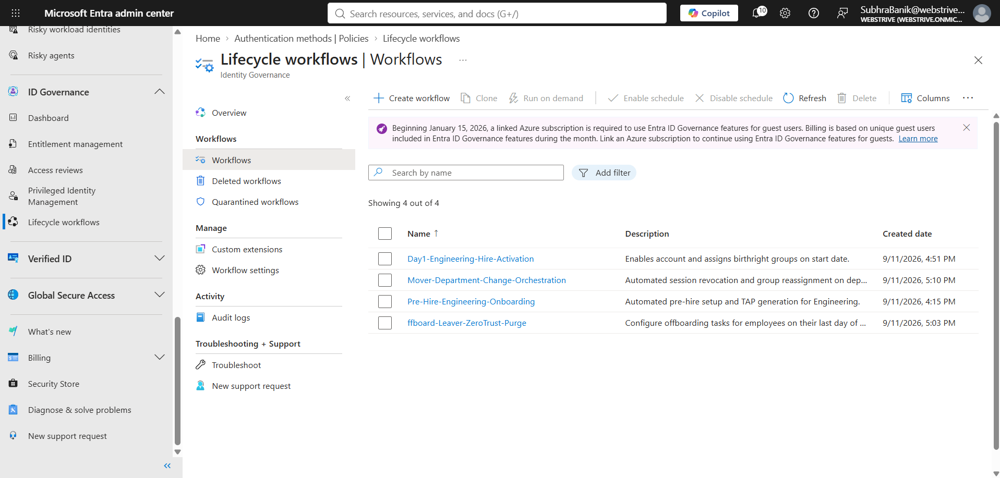
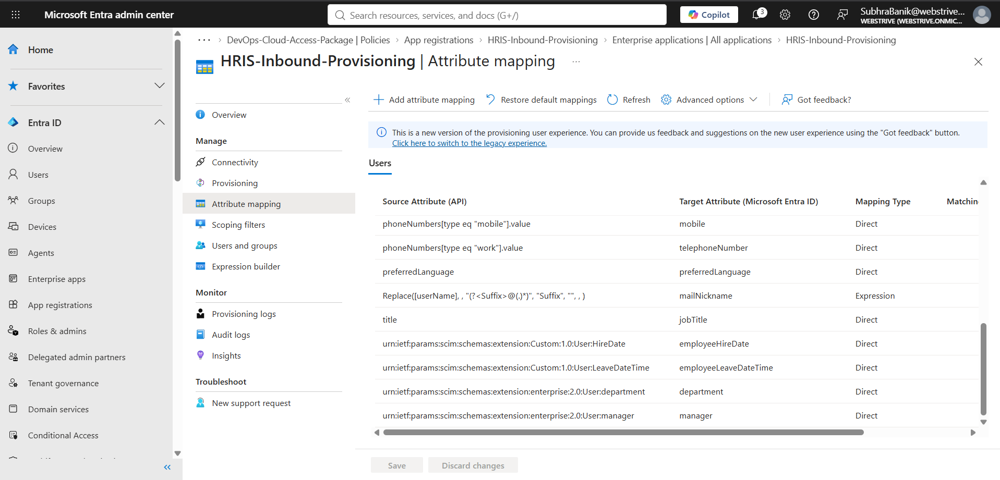

# Enterprise Identity Governance & Administration (IGA): End-to-End Zero Trust JML Orchestration in Microsoft Entra ID

## Executive Summary & Architecture Overview

Modern enterprise Identity Governance and Administration (IGA) requires identity lifecycles to be dynamically governed from an authoritative System of Record (HRIS), eliminating unmanaged directory scripts and static access assignments. 

This repository documents an enterprise-grade **Joiner-Mover-Leaver (JML)** governance architecture implemented natively within **Microsoft Entra ID Governance**. It demonstrates authoritative cloud-native API provisioning via SCIM 2.0, Day-0 passwordless onboarding, self-service approval-governed entitlement packages, lateral movement mitigation, and automated Zero Trust termination with immediate session invalidation.

+---------------------+          SCIM 2.0           +-------------------------------+
| Authoritative HRIS  | --------------------------> | API-Driven Inbound            |
| (Workday / Payload) |   POST /bulkUpload          | Provisioning (Microsoft Entra)|
+---------------------+   (application/scim+json)   +---------------+---------------+
|
Ingests Identity Attributes
(employeeHireDate, department)
v
+-------------------------------------------------------------------+-----------------------------------+
|                            Microsoft Entra ID Governance Engine                                   |
|                                                                                                       |
|  +---------------------------+  +----------------------------+  +----------------------------------+  |
|  |   Joiner Orchestration    |  |     Mover Orchestration    |  |       Leaver Orchestration       |  |
|  | - Pre-Hire TAP Generation |  | - Cross-Department Switch  |  | - Immediate Account Disablement  |  |
|  | - Day-1 Account Enable    |  | - Revoke Access Packages   |  | - Purge Group Memberships        |  |
|  | - Birthright Group Grants |  | - Invalidate OAuth Tokens  |  | - Revoke All Active Sessions     |  |
|  +---------------------------+  +----------------------------+  +----------------------------------+  |
|                                                ^                                                      |
|                                                | Governs Time-Bound Access                            |
|                                 +--------------+---------------+                                      |
|                                 |   Entitlement Management     |                                      |
|                                 | - 90-Day Access Package      |                                      |
|                                 | - 1-Stage Manager Approval   |                                      |
|                                 | - Quarterly Access Reviews   |                                      |
|                                 +------------------------------+                                      |
+-------------------------------------------------------------------------------------------------------+

### Key Architectural Capabilities
* **Authoritative Inbound Ingestion:** Direct REST integration using Microsoft Entra API-driven Inbound Provisioning (`API2AAD`) handling asynchronous RFC 7644 SCIM 2.0 payloads.
* **Passwordless Day-0 Onboarding:** Pre-hire lifecycle automation generating time-bound Temporary Access Passes (TAP) delivered securely to managers.
* **Automated Birthright Allocation:** Day-1 automated account activation and baseline security group provisioning based on inbound HR attributes.
* **Governed Just-in-Time Access:** Request-based Entitlement Management packages with mandatory business justifications, 1-stage manager approval workflows, 90-day automatic expiration, and recurring quarterly access recertifications.
* **Lateral Movement Mitigation (Mover):** Automated departmental transition logic that swaps security groups, revokes privileged access packages, and forces OAuth/OIDC session invalidation (`RevokeSignInSessions`).
* **Zero Trust Privilege Purge (Leaver):** Instant termination workflow enforcing immediate account disablement, recursive group stripping, and complete active session purging.


*Figure 1: Microsoft Entra API-Driven Provisioning Service Principal (`API2AAD`) configuration showing active inbound synchronization status.*


*Figure 2: Complete Microsoft Entra ID Lifecycle Workflow orchestration matrix across Pre-Hire, Day-1, Mover, and Leaver stages.*

---

## 1. Authoritative Identity Ingestion (SCIM 2.0 API Pipeline)

To avoid identity drift and manual synchronization delays, user identities are ingested through Entra ID's cloud-native inbound provisioning API. This mirrors modern enterprise HRIS architectures (e.g., Workday, SAP SuccessFactors) where HR actions drive downstream identity states.


*Figure 3: Attribute mapping schema transforming SCIM core and enterprise extension attributes into directory-level targets.*

### Inbound Ingestion Mechanics
Worker identities are posted as RFC 7644 SCIM 2.0 Bulk Operations to the Microsoft Graph synchronization endpoint:

```http
POST /v1.0/servicePrincipals/92cd35db-deb0-4869-9341-0cafcfc7f43f/synchronization/jobs/API2AAD.ae8194c846bd42babfcf8e264ba4dd28.aab1eaf8-f1d4-4590-b46c-a5fbeb59184c/bulkUpload
Host: graph.microsoft.com
Content-Type: application/scim+json
Authorization: Bearer <Graph_Access_Token>

JSON

{
  "schemas": ["urn:ietf:params:scim:api:messages:2.0:BulkRequest"],
  "Operations": [
    {
      "method": "POST",
      "bulkId": "897401c2-2de4-4b87-a97f-c02de3bcf611",
      "path": "/Users",
      "data": {
        "schemas": [
          "urn:ietf:params:scim:schemas:core:2.0:User",
          "urn:ietf:params:scim:schemas:extension:enterprise:2.0:User"
        ],
        "externalId": "ENG-9041",
        "userName": "kabir.mehta@webstrive.onmicrosoft.com",
        "displayName": "Kabir Mehta",
        "active": true,
        "name": {
          "formatted": "Kabir Mehta",
          "familyName": "Mehta",
          "givenName": "Kabir"
        },
        "emails": [
          {
            "value": "kabir.mehta@webstrive.onmicrosoft.com",
            "type": "work",
            "primary": true
          }
        ],
        "urn:ietf:params:scim:schemas:extension:enterprise:2.0:User": {
          "department": "Engineering",
          "employeeNumber": "9041"
        }
      }
    }
  ]
}

Figure 4: Inbound provisioning pipeline accepting the bulk payload asynchronously with HTTP status code 202 Accepted.

Figure 5: Entra ID Provisioning Audit log verifying successful ingestion and property synchronization for Kabir Mehta (ENG-9041).

2. Joiner Orchestration: Day-0 Pre-Hire & Day-1 Activation
Day-0 Passwordless Onboarding (Pre-Hire)
To comply with modern Zero Trust authentication baselines and prevent initial password distribution via insecure channels, the Pre-Hire-Engineering-Onboarding workflow is triggered by the identity's employeeHireDate.

Automated Action: Generates a 24-hour Temporary Access Pass (TAP) with one-time use constraints.

Notification Routing: Securely dispatches credential retrieval instructions directly to the user's manager (Subhra Banik).

Figure 6: Execution log verifying automated Temporary Access Pass generation and delivery to the manager.

Day-1 Account Activation & Birthright Access
On the official hire date, the Day1-Engineering-Hire-Activation workflow executes automatically:

Account Enablement: Validates the account state and unlocks interactive login.

Birthright Group Grant: Adds the account to SG-Eng-Assigned to deliver baseline departmental licensing and resources.

Onboarding Notification: Dispatches tenant-specific welcome guides and self-service portal links.

Figure 7: Completed Day-1 activation confirming zero-touch account enablement and birthright group assignment.

3. Governed Privilege Allocation: Entitlement Management
Privileged operational access is kept separate from birthright security groups. Additional access requirements are governed through Microsoft Entra Entitlement Management Access Packages.

Figure 8: Active 90-day time-bound assignment for Kabir Mehta within the DevOps-Cloud-Access-Package.

Governance Guardrails & Policy Configuration
Catalog Isolation: Resources organized within the Engineering-Services-Catalog.

Approval Workflow: Mandatory business justification submitted to a 1-stage manager approval gate.

Time-Bound Validity: Access expires automatically after 90 days.

Automated Compliance Recertification: Quarterly manager access reviews run automatically; non-reviewed assignments are automatically revoked.

4. Mover Orchestration: Lateral Movement Mitigation
When an employee changes roles or departments, retaining obsolete privileges creates toxic privilege accumulation and opens avenues for lateral movement.

The transition is simulated by updating the HR attribute from Department = Engineering to Department = Finance, triggering the Mover-Department-Change-Orchestration workflow.

Figure 9: Mover orchestration verifying access package revocation, group rotation, and active session invalidation.

Executed Security Controls
Privilege De-provisioning: Invokes Entitlement Management to revoke DevOps-Cloud-Access-Package assignments.

Security Group Rotation: Removes SG-Eng-Assigned and adds SG-Fin-Assigned.

Zero Trust Session Revocation: Calls RevokeSignInSessions via Microsoft Graph to kill existing OAuth/OIDC refresh tokens, terminating persistent browser sessions immediately.

5. Leaver Orchestration: Zero Trust Access Isolation
When employment ends, the Offboard-Leaver-ZeroTrust-Purge workflow executes an automated identity shutdown across all connected cloud resources.

Figure 10: Offboarding execution log confirming account disablement, group stripping, and token invalidation.

Offboarding Actions
Interactive Disablement: Account status changed to Disabled.

Security Group Purge: Removes user from all assigned security groups and Microsoft 365 Teams.

Session Invalidation: Immediate token revocation to prevent unauthorized access from active sessions.

Figure 11: Final directory verification showing Kabir Mehta's disabled account, 0 group memberships, and 0 active assignments.

6. Engineering Incident Log & Root Cause Analysis (RCA)
During the deployment of this architecture, several real-world protocol, schema, and policy conflicts occurred. The following log documents each incident, its root cause, and the engineering remediation applied.

+-------------------------------------------------------------------------------------------------------+
|                                    INCIDENT TRIAGE & RESOLUTION LOG                                   |
+---+-----------------------------+------------------------------------+--------------------------------+
| # | Incident Phenomenon         | Root Cause Mechanism               | Engineering Remediation        |
+---+-----------------------------+------------------------------------+--------------------------------+
| 1 | SCIM Ingestion 400 Error    | Missing SCIM MIME type & PS array  | Added application/scim+json    |
|   | "Invalid Data Format"       | unwrapping during serialization    | and raw multi-line JSON payload|
+---+-----------------------------+------------------------------------+--------------------------------+
| 2 | TAP Generation Failure      | Missing temporal anchor            | Populated employeeHireDate and |
|   | "EmployeeHireDate missing"  | and reporting manager attributes   | assigned manager identity      |
+---+-----------------------------+------------------------------------+--------------------------------+
| 3 | Mover Schedule Rejection    | 15-day workflow grace period       | Enabled allowCustomAssignment- |
|   | "Custom schedule prevented" | blocked by access package policy   | Schedule on access package     |
+---+-----------------------------+------------------------------------+--------------------------------+
| 4 | Leaver License Purge Failure| Direct license modification        | Removed direct task; relied on |
|   | "License is inherited"      | rejected on Group-Based Licenses   | cascading group-based removal  |
+---+-----------------------------+------------------------------------+--------------------------------+

Incident 1: SCIM Protocol Deserialization & Media-Type Rejection (400 Bad Request)
Figure 12: Graph Explorer returning HTTP 400 Bad Request during initial bulk upload testing.

Symptom: HTTP POST requests to /synchronization/jobs/.../bulkUpload were rejected with 400 Bad Request: "Invalid Data Format".

Root Cause Analysis:

Standard HTTP testing clients default to Content-Type: application/json. Entra ID's SCIM ingestion engine strictly adheres to RFC 7644 Section 3.13, which mandates the custom MIME type application/scim+json.

In Windows PowerShell 5.1, ConvertTo-Json flattens single-element arrays (such as "schemas": [...]) into scalar strings unless -AsArray is passed, generating invalid SCIM JSON schemas.

Remediation: Configured explicit request headers (Content-Type: application/scim+json) and constructed raw multi-line string payloads to prevent JSON array unwrapping.

Incident 2: Day-0 Pre-Hire Prerequisite Failure (Missing Attribute)
Figure 13: Lifecycle workflow task failure resulting from unpopulated user profile attributes.

Symptom: The Pre-Hire-Engineering-Onboarding workflow failed on task Generate TAP and email manager with:

EmployeeHireDate attribute is missing

Root Cause Analysis: Entra ID Lifecycle Workflows enforce strict temporal boundaries. The Temporary Access Pass generation task calculates activation and expiration dates directly from employeeHireDate. Because this field was null on the newly provisioned account, the task failed immediately without evaluating downstream actions. Additionally, the task requires an assigned manager attribute to deliver the TAP securely.

Remediation: Populated the employeeHireDate attribute, assigned Subhra Banik as the reporting manager, and verified that the tenant-level TAP Authentication Method policy was enabled.

Incident 3: Mover Grace Period & Entitlement Policy Conflict
Figure 14: Lifecycle Workflow Mover task failure caused by an Entitlement Management schedule conflict.

Symptom: The Mover workflow task Remove all access package assignments for user failed with:

Error code: InvalidRequest
Error message: Custom assignment schedule is prevented by policy.

All subsequent workflow tasks (Revoke tokens, Add to SG-Fin-Assigned, Remove from SG-Eng-Assigned) were automatically marked Canceled.Root Cause Analysis: The built-in Mover task does not instantly terminate access packages; it schedules an expiration date (defaulting to 15 days) to provide an operational grace period. However, the access package policy had Users can request a specific timeline (allowCustomAssignmentSchedule) set to No. When the workflow requested a custom expiration date, Entitlement Management rejected the request.Remediation: Edited Initial Policy under DevOps-Cloud-Access-Package $\rightarrow$ Lifecycle and set Users can request a specific timeline to Yes. Re-running the workflow succeeded across all five tasks.Incident 4: Direct User License Stripping vs. Group-Based Licensing (GBL)Symptom: The leaver workflow task Remove all licenses for user returned an API error:

User license is inherited from a group membership and it cannot be removed directly from the user.

Root Cause Analysis: The tenant utilized Group-Based Licensing (GBL) via SG-Eng-Assigned. Entra ID enforces an architectural boundary between direct assignments and group-inherited licenses: inherited licenses cannot be modified or stripped directly on the user object.Remediation: Removed the redundant Remove all licenses for user task from the workflow. Stripping the user's group memberships via Remove user from all groups automatically triggers background license de-allocation, preserving clean automation logs.Industry Frameworks & Compliance AlignmentStandard / BenchmarkArchitectural ImplementationVerification EvidenceNIST SP 800-207 (Zero Trust)Explicit validation, continuous session evaluation, lateral movement controls09-mover-remediation-success.pngRFC 7644 (SCIM 2.0)Standardized RESTful bulk provisioning via /bulkUpload04-api-scim-dispatch-success.pngLeast Privilege (PoLP)Time-bound access packages with manager justification and expiration08-governed-access-package.pngCISA Passwordless GuidanceDay-0 Temporary Access Pass (TAP) replacing static temporary credentials06-prehire-tap-generation.pngMicrosoft SC-300 IAM BenchmarkAuthoritative inbound provisioning, Lifecycle Workflows, and Entitlement Management11-final-disabled-identity-state.png

Repository Structure & Replication Guide

entra-id-governance-jml/
├── README.md
├── payloads/
│   └── scim-bulk-upload.json
└── assets/
    ├── 01-inbound-provisioning-service.png
    ├── 02-lifecycle-workflows-matrix.png
    ├── 03-scim-attribute-mapping.png
    ├── 04-api-scim-dispatch-success.png
    ├── 05-inbound-provisioning-audit.png
    ├── 06-prehire-tap-generation.png
    ├── 07-day1-activation-success.png
    ├── 08-governed-access-package.png
    ├── 09-mover-remediation-success.png
    ├── 10-leaver-zerotrust-purge.png
    ├── 11-final-disabled-identity-state.png
    ├── triage-01-scim-bad-request.png
    ├── triage-02-tap-missing-attribute.png
    └── triage-03-mover-schedule-rejection.png

    Replication Steps
Deploy Inbound Provisioning:

Create an enterprise application using the API-driven provisioning to Microsoft Entra ID gallery template.

Enable the provisioning service and record the Graph API bulk upload endpoint URL.

Configure Lifecycle Workflows:

Configure Pre-Hire-Engineering-Onboarding (trigger: -1 days before employeeHireDate, action: Generate TAP).

Configure Day1-Engineering-Hire-Activation (trigger: 0 days from employeeHireDate, action: Enable account, add to SG-Eng-Assigned).

Configure Mover-Department-Change-Orchestration (trigger: attribute change department, actions: revoke packages, revoke sessions, swap groups).

Configure Offboard-Leaver-ZeroTrust-Purge (trigger: manual or scheduled offboarding, actions: disable account, remove from all groups, revoke all refresh tokens).

Configure Access Package:

Create an access catalog and package (DevOps-Cloud-Access-Package).

Set 1-stage manager approval, require justification, enforce 90-day expiration, and set allowCustomAssignmentSchedule = Yes.

Execute Ingestion & Lifecycle Events:

Dispatch payloads/scim-bulk-upload.json via Microsoft Graph Explorer.

Execute workflows on-demand to validate each lifecycle stage across the identity.

